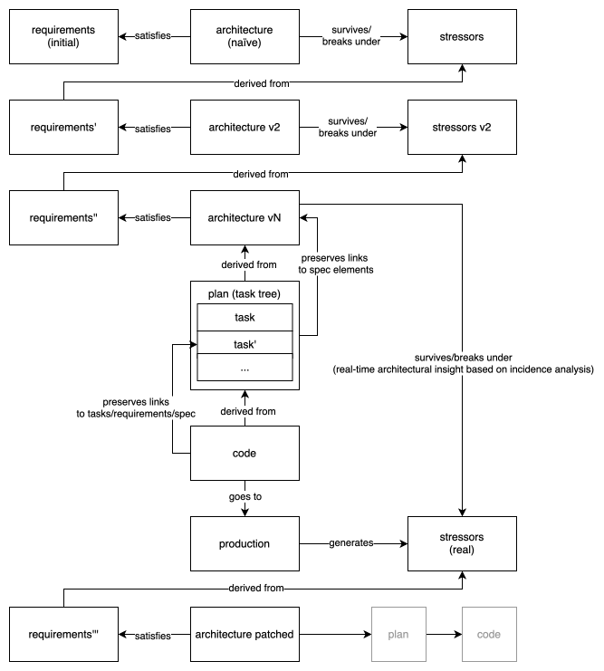

# Archiplan

An environment where your software's context live

Models are stored as source code: a project of `.arch` files — diffable, modular, compiled fresh on every run
(`requirements/modeling-lang/source-format.md`). The source is the only source of truth: the JSON statement layer
(`requirements/modeling-lang/modeling-lang.md`) is what it compiles to — and the read surface for agents — not a
second editing surface. `archi check` compiles and lints a project; `archi nkp` analyzes it;
`archi incidence` reads a stress round back as the stressor × component matrix and its findings
(`requirements/scoring/incidence.md`); `archi build --emit-batch` shows the lowered statements;
`archi link` ties spec elements to the code that realizes them and verifies the tie against the tree
(`requirements/code-link.md`).