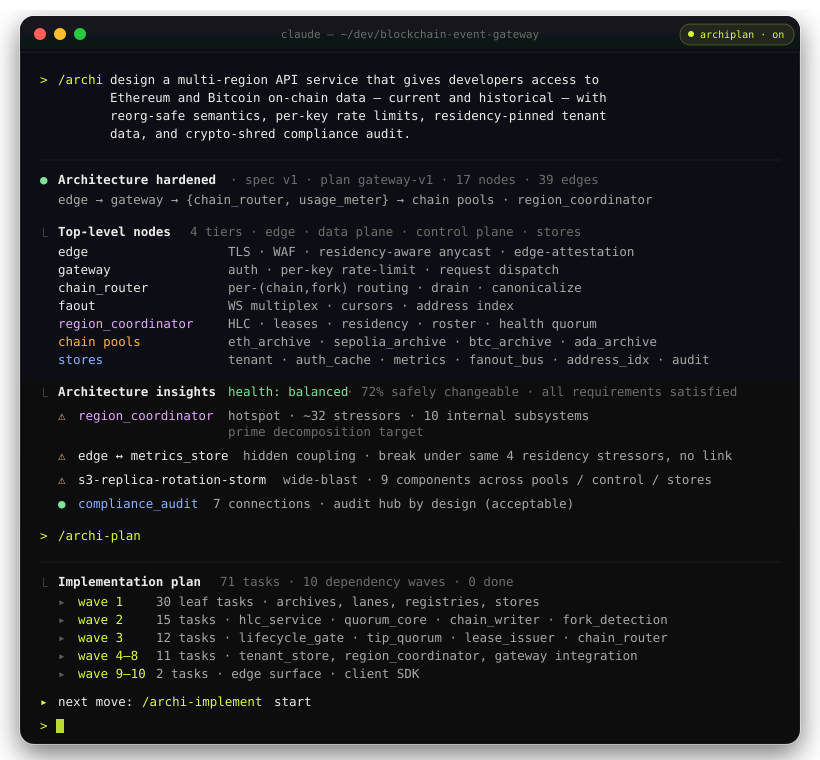
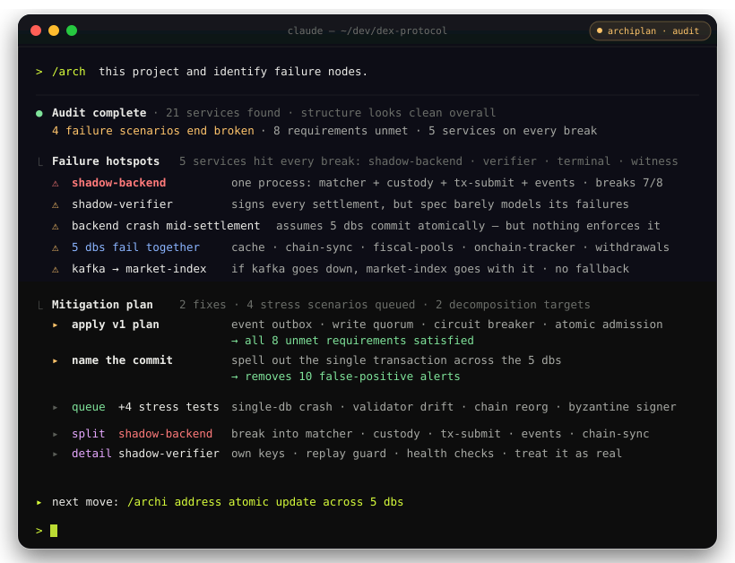
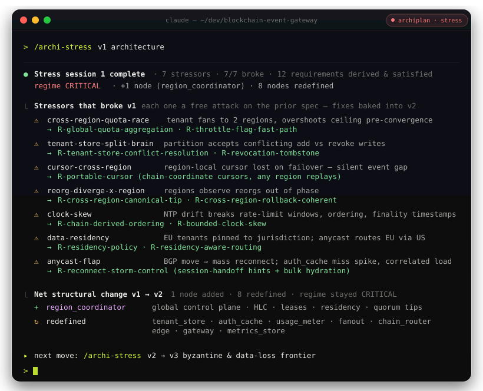
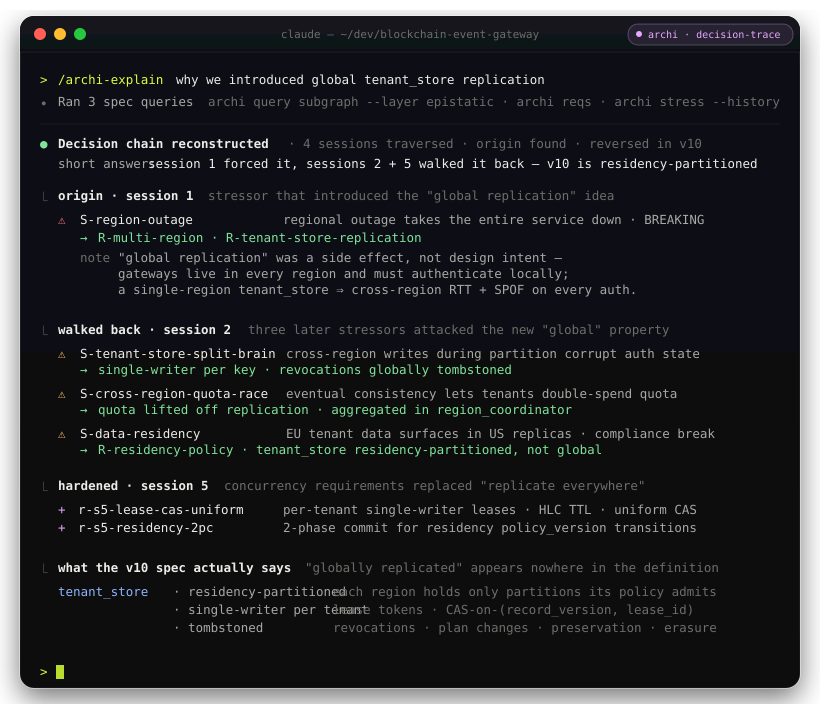
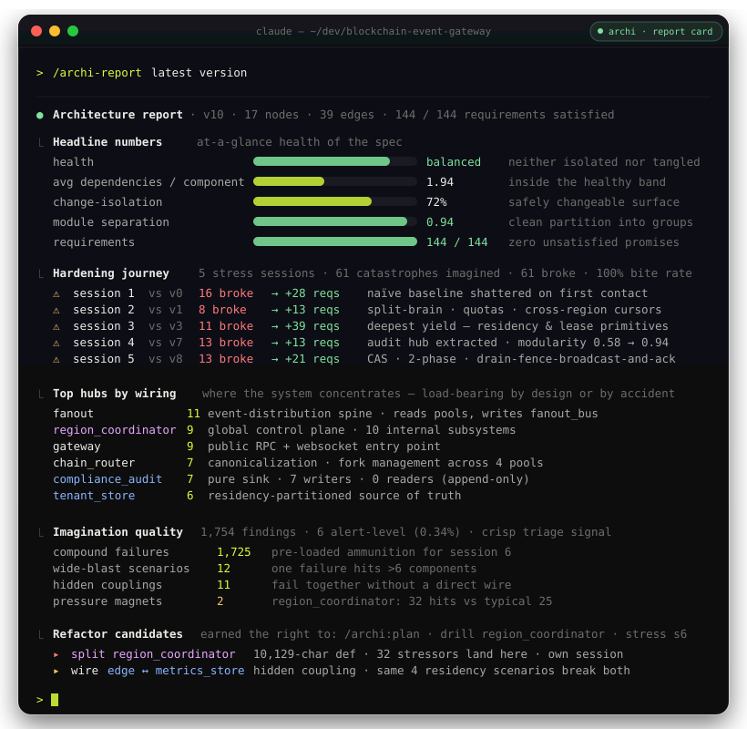

# Archiplan

AI cares little about architecture, but writes code faster than we read it.

Connect Archiplan to your agent and the code it writes gets a real
architecture behind it — stress-tested and traceable before anything ships.



## 01 — Install

Install the `archi` CLI:

```sh
curl -sSf https://archiplan.ai/install.sh | sh
```

Windows (PowerShell):

```powershell
irm https://archiplan.ai/install.ps1 | iex
```

The installer resolves the latest release for your platform and drops the binary
into `~/.local/bin` — make sure it is on your `PATH`, then confirm with
`archi --version`. Pin a version with `ARCHI_VERSION=x.y.z`.

## 02 — Getting started

Everything after the install happens inside your agent — no commands to memorize.

### New project

Open your agent in the project folder, run `/archi`, describe the system in one
sentence. The agent takes it from there:

- intent → requirements → model → stress rounds → a hardened, versioned spec
- every choice that matters comes back as a question with priced options
- `/archi-plan` — the implementation plan; stack, tests and infrastructure polled from you
- `/archi-implement` — waves of parallel sub-agents until done, scenarios run on a live stack

### Existing project

Run `/archi` in the repo and name the change you want:

- the model is recovered from the code — only the slice your change touches
- requirements pin the behavior that must not break; links anchor the load-bearing code
- from there the loop is the same: stress, version, `/archi-plan`, `/archi-implement`



### Multi-repo

Spec in one repository, code in several. Tell the agent which repos participate:

- each member is seated beside its checkout — same branch, grown from its recorded baseline
- an ambiguous base comes back as candidate branches, never a guess
- members land by push and PR on their forges; the spec lands once, whole

### The worktree seat

- one unit — spec, then plan, then code — rides one worktree and lands once
- parallel efforts are parallel seats; your main checkout is never mutated
- the tools refuse work done outside the discipline — and say where to go

## 03 — Every skill, by what you're doing

The install drops the workflow skills into your agent, all invoked with a slash
command. Grouped by the job at hand.

### Design the architecture

**`/archi`** — the main entry point. Guides a full architecture session with the
archiplan methodology — from a one-line problem statement, through intent and
requirements, to a hardened, versioned spec. Greenfield or brownfield. Tracks coupling
live with the NKP scoring line, steering you toward the **CRITICAL** regime — the
evolvable edge where changes propagate without cascading. Stress rounds live here too:
each round discovers stressors — failure modes, scale concerns, hostile users,
regulators — names the components each one presses, applies verdicts, and turns every
break into a derived requirement or a deliberately signed trade-off. You loop until a
round survives; that version is the hardened spec.

### Plan & build

**`/archi-plan`** — turns a hardened spec into an implementation plan, authored
entirely through the `archi plan` verbs: an envelope with a user-polled stack and its
infrastructure, one task per node, requirement ownership curated from the spec's own
reverse lookup, named verifications, end-to-end scenarios. Refuses on an unsaved model.

**`/archi-implement`** — drives the build of a started plan wave by wave, every task in
its own sub-agent, until `archi plan next` reports `DONE`. The plan stays the source of
truth — task briefs come from `archi plan task show`; every wave commits inside the
seat before the join, and code-link evidence is captured as each wave closes.

### Land & merge

**`/archi-finish-worktree`** — closes a seat: lands its spec/plan/code unit, pushes
member branches for their PRs, retires the worktree and its registry binding in one
move. A protected receiving branch lands sideways (`--to` + push + PR), never by local
merge.

**`/archi-merge`** — two branches that both mutated the spec: triage the join with
`check`, resolve version-archive collisions with `remint`, read the journal's absorbed
residue, fold concurrent stress rounds. The contract is the canonical render — git
merging clean proves nothing until the composition compiles.

## 04 - See it in action

### Pre-mortem on every design

Archiplan throws traffic spikes, partial outages, hostile users, and regulators at the spec — before you ship code that pretended those don't exist. Anything that breaks becomes a new requirement.



### Never lose context

Every requirement remembers its origin — the initial problem, a specific stressor, a stakeholder concern. Six months later, when someone asks why did we split this from that?, the answer is an artifact, not a lost Slack thread.



### Fine-tune your architecture

Archiplan flags when your design is heading toward a god-service or microservices-for-microservices' sake — before "we should refactor" turns into "we have to rewrite."



## 05 - How Archiplan integrates into software development life cycle

Evolutionary approach to system design, then continous tracking of cause-and-effect:


---

Archi is in beta. It's rough in places — that's the point. We're hardening it the way
archi hardens a spec, and the fastest way to make it better is to hear what breaks for
you. Try it on a real design and tell us where it bends.

Go deeper:

- [skills/archi.md](skills/archi.md) — the full workflow, greenfield and brownfield, and the modeling language in brief
- [docs/versioning.md](docs/versioning.md) — what a version is and why the archive is durable
- [docs/multi-repo-workflow.md](docs/multi-repo-workflow.md) — the loop when code lives in repositories of its own

*Archiplan — plan mode on steroids.*
