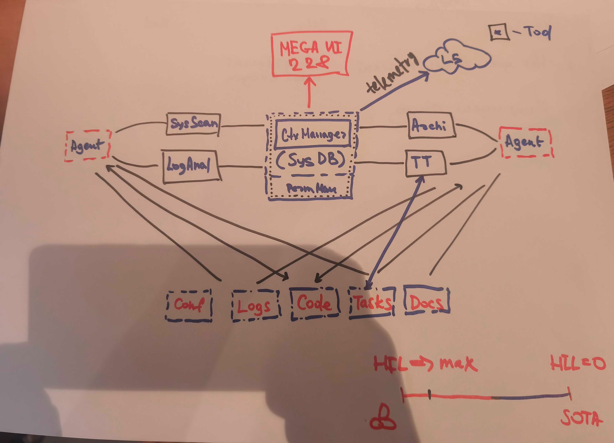

# System Overview

A context-management system that covers the **end-to-end** development flow.
It acts as a **harness around AI agents**: it manages the AI context — the
spec, its links to code / docs / tasks, and their freshness — and exposes
tooling through which agents read and update that context.

The system **embeds into the user's existing workflow**. It doesn't care which
external services they use for code, tasks, docs, logs, or config — it
references and indexes them, but doesn't own or replace them.

## Components

- **Context Manager (CM)** — the single backend and authoritative layer for the
  spec, its links, and their freshness. It authenticates and authorizes every
  caller itself (identity, tenancy, RBAC, tokens, the Permission Manager
  `Perm Man`). Storage is **one store** behind a decorator (engine hidden,
  default Postgres): a fixed schema part (identity / access) and a per-client
  context part in the same database. All clients call the CM's API.
  See [`context-manager/`](context-manager/description.md).
- **Tooling (CLI / MCP)** — the agent's way to reach the CM, the same role the
  UI plays for a human: a **client** that calls the CM's API — a CLI or MCP
  service driven by the agent. A **hook** is the CM invoking such a CLI / MCP
  handle on an event.
  - **Sys Scan** — see [`sys-scan/`](sys-scan/).
  - **Archi** — the spec / architecture tool. See [`archi/`](archi/).
  - **Task Tracker (TT)** — external task-tracker integration. See [`task-tracker/`](task-tracker/).
  - **Log Analyzer** — see [`log-analyzer/`](log-analyzer/).
- **Interface (MEGA UI)** — the user-facing client. Same role as the tooling,
  for humans. See [`interface/`](interface/).
- **Agents** — the AI agents that drive the tooling (CLI / MCP).
- **License Server (LS)** — the commercial control plane: activation, licenses,
  signed leases, fleet inventory, and the telemetry stream. The **CM** is its
  single point of contact (`CM → LS`, the system's only egress). See
  [`license-server/`](license-server/description.md).

## External systems

`Conf`, `Logs`, `Code`, `Tasks`, `Docs` are the user's own services. The system
integrates with whatever they already use; it holds references and freshness
status, but does not own the data.

## Delivery

The system is delivered **per customer** — we operate the deployment (cloud) or
the customer self-hosts it; the system is the same either way. See
[`delivery.md`](delivery.md).

## Direction (HIL)

The system spans the human-in-the-loop axis: from **HIL → max** (current state,
β) toward **HIL = 0** (fully autonomous — the SOTA goal).
